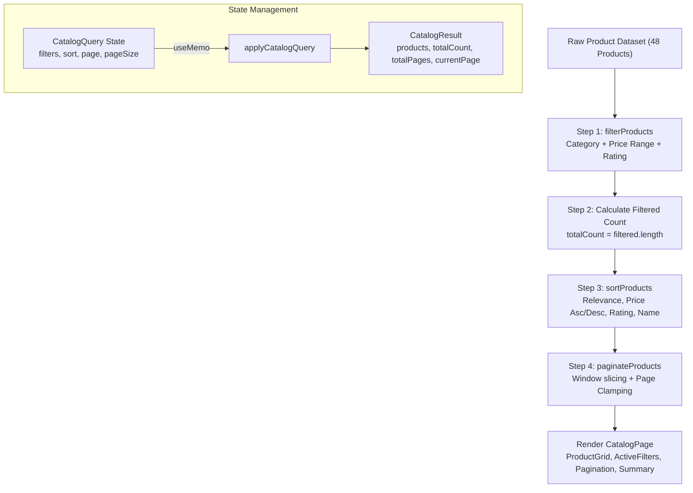

# 🛍️ LUMINA — High-Performance Product Catalog & Faceted Filter System

🌐 **Live Demo:** [https://lumina-catalog.vercel.app/](https://lumina-catalog.vercel.app/)  
📦 **Repository:** [https://github.com/parikshit245/Entrata-ai-coding-challange-E](https://github.com/parikshit245/Entrata-ai-coding-challange-E)

An enterprise-grade, responsive e-commerce product catalog built with **Next.js 16 (App Router)**, **React 19**, **TypeScript**, and **Tailwind CSS**. It features deterministic faceted filtering (multi-category, dynamic price range, rating threshold), multi-attribute sorting, state-preserving pagination, responsive mobile drawer controls, and an isolated pure business logic pipeline verified with **92 automated unit and integration tests**.

---

## 📑 Table of Contents

1. [System Architecture & Processing Pipeline](#-system-architecture--processing-pipeline)
2. [Component Hierarchy](#-component-hierarchy)
3. [Key Features & Capabilities](#-key-features--capabilities)
4. [State Management Architecture](#-state-management-architecture)
5. [Tech Stack](#-tech-stack)
6. [Project Structure](#-project-structure)
7. [Getting Started & Installation](#-getting-started--installation)
8. [Available Scripts](#-available-scripts)
9. [Testing Strategy](#-testing-strategy)
10. [Design System & Accessibility](#-design-system--accessibility)

---

## 🏛️ System Architecture & Processing Pipeline

The application isolates **pure computational business logic** from **UI presentation components**. Filtering, counting, sorting, and pagination operate in a strictly ordered, deterministic pipeline that prevents stale reads, race conditions, or off-by-one pagination traps.

### Data Processing Pipeline Diagram



### Text Flow Representation

```text
┌────────────────────────────────────────────────────────┐
│ Raw Products Dataset (48 items across 7 categories)    │
└──────────────────────────┬─────────────────────────────┘
                           │
                           ▼
┌────────────────────────────────────────────────────────┐
│ 1. Filter Phase (filterProducts)                       │
│    • Category: Multi-select OR within category         │
│    • Price: min <= price <= max                        │
│    • Rating: rating >= minRating                       │
│    • Combination: strict AND across all active filters │
└──────────────────────────┬─────────────────────────────┘
                           │
                           ▼
┌────────────────────────────────────────────────────────┐
│ 2. Count Phase (Capture Total Filtered Count)          │
│    • totalCount calculated on filtered set             │
│    • Independent of pagination slice                   │
└──────────────────────────┬─────────────────────────────┘
                           │
                           ▼
┌────────────────────────────────────────────────────────┐
│ 3. Sort Phase (sortProducts)                           │
│    • Global sorting applied to the full filtered set   │
│    • Never mutates original dataset (pure slice)       │
└──────────────────────────┬─────────────────────────────┘
                           │
                           ▼
┌────────────────────────────────────────────────────────┐
│ 4. Paginate Phase (paginateProducts)                   │
│    • totalPages = ceil(totalCount / pageSize)          │
│    • Automatic page clamping [1, totalPages]           │
│    • Slice to current page window                      │
└──────────────────────────┬─────────────────────────────┘
                           │
                           ▼
┌────────────────────────────────────────────────────────┐
│ 5. Presentation Layer (ProductGrid, Sidebar, Toolbar)  │
└────────────────────────────────────────────────────────┘
```

---

## 🧩 Component Hierarchy

```text
Root Layout (src/app/layout.tsx)
│
└── CatalogPage (src/app/page.tsx) [Single Source of Truth via useCatalog()]
    │
    ├── Navbar (src/components/layout/Navbar.tsx)
    │   ├── Brand Logo & Identity
    │   ├── Quick Category Shortcuts
    │   └── E-Commerce Utility Badges (Cart, Wishlist, Profile)
    │
    ├── HeroSection (src/components/layout/HeroSection.tsx)
    │   ├── Live Metrics & Inventory Counter
    │   ├── Headline & Value Propositions
    │   └── Interactive Quick Filter Pills with Smooth Scroll
    │
    ├── MobileFilterDrawer (src/components/catalog/MobileFilterDrawer.tsx)
    │   ├── Backdrop Blur & Accessible Dialog Trap
    │   ├── Reusable Filter Controls (Category, Price, Rating)
    │   └── Quick Reset & Apply CTA Actions
    │
    └── Main Content Container
        ├── Top Toolbar
        │   ├── Mobile Filter Open Trigger
        │   ├── ResultsSummary (src/components/catalog/ResultsSummary.tsx)
        │   └── SortControl (src/components/catalog/SortControl.tsx)
        │
        ├── ActiveFilters (src/components/catalog/ActiveFilters.tsx)
        │   └── Dismissible Pill Badges with Individual '✕' & 'Clear all'
        │
        └── Two-Column Layout
            ├── FilterSidebar (src/components/catalog/FilterSidebar.tsx) [Desktop lg+]
            │   ├── CategoryFilter (src/components/catalog/CategoryFilter.tsx)
            │   ├── PriceFilter (src/components/catalog/PriceFilter.tsx)
            │   └── RatingFilter (src/components/catalog/RatingFilter.tsx)
            │
            └── Product Area
                ├── ProductGrid (src/components/catalog/ProductGrid.tsx)
                │   ├── ProductCard (src/components/catalog/ProductCard.tsx) [Grid Items]
                │   └── Empty State Illustration (when 0 results match)
                │
                └── Pagination (src/components/catalog/Pagination.tsx)
```

---

## ✨ Key Features & Capabilities

- **Multi-Select Category Filtering**: Choose one or multiple categories simultaneously (OR within categories, AND across other criteria).
- **Price Range Boundaries**: Numeric minimum and maximum price inputs with instant error detection when `min > max`.
- **Minimum Star Rating**: Toggleable minimum rating filter (4.5+, 4.0+, 3.5+, 3.0+) with rendered vector stars.
- **Deterministic Sorting**:
  - _Relevance_ (Editorial default order)
  - _Price: Low to High_ / _Price: High to Low_
  - _Highest Rated_ (with review count secondary tie-breaker)
  - _Name: A–Z_ (alphabetical)
- **Preserving State across Pagination**: Navigating between pages never discards active filters or sort options.
- **Intelligent Page Clamping**: If applying a strict filter on page 4 reduces total pages to 1, the system automatically clamps to page 1 without breaking.
- **Dismissible Active Filter Chips**: Real-time summary pills allowing one-click removal of individual filters or clearing all filters at once.
- **Responsive Mobile Experience**: Dedicated slide-in filter drawer with blurred backdrop, native touch scrolling, and instant synchronization with the desktop view.
- **High-Resolution Photography**: Optimized product cards with Unsplash image photography, category badges, and hover lift effects.
- **Rich Zero-State Handling**: Context-aware empty state with a direct "Clear all filters" recovery action.

---

## 🔄 State Management Architecture

All catalog state is managed in [`src/hooks/useCatalog.ts`](file:///c:/7th%20Semester/Entrata-challange/product-catalog-challenge/src/hooks/useCatalog.ts) through a single atomic `CatalogQuery` state object:

```typescript
export interface CatalogQuery {
  filters: {
    categories: ProductCategory[];
    priceRange: { min: number | null; max: number | null };
    minRating: number | null;
  };
  sort: SortOption;
  page: number;
  pageSize: number;
}
```

### State Transition Invariants

1. **Filter Change** → Updates filter state and atomically resets `page = 1`.
2. **Sort Change** → Updates sort parameter and atomically resets `page = 1`.
3. **Page Change** → Modifies only the `page` index, preserving all active filters and sort settings.
4. **Reset Action** → Restores all parameters to `DEFAULT_CATALOG_QUERY` in a single update.
5. **Derived Result** → Fully computed via `useMemo(() => applyCatalogQuery(PRODUCTS, query), [query])`.

---

## 🛠️ Tech Stack

| Technology         | Purpose                                                   |
| ------------------ | --------------------------------------------------------- |
| **Next.js 16.3.3** | React Framework (App Router, Turbopack)                   |
| **React 19.2.8**   | UI Library & Hooks (`useMemo`, `useState`, `useCallback`) |
| **TypeScript 5**   | Static type safety and strict schema definitions          |
| **Tailwind CSS 4** | Design-token-driven utility styling                       |
| **Vitest 4.1.11**  | Unit & Integration test runner                            |
| **ESLint 9**       | Code quality & static linting                             |
| **Prettier**       | Code formatting                                           |

---

## 📁 Project Structure

```text
product-catalog-challenge/
├── src/
│   ├── app/
│   │   ├── favicon.ico
│   │   ├── globals.css              # Design tokens (colors, radii, typography)
│   │   ├── layout.tsx               # Root layout & meta tags
│   │   └── page.tsx                 # Main client page coordinating useCatalog()
│   ├── components/
│   │   ├── catalog/
│   │   │   ├── ActiveFilters.tsx    # Dismissible filter chips
│   │   │   ├── CatalogHeader.tsx    # Page header
│   │   │   ├── CategoryFilter.tsx   # Category checkboxes
│   │   │   ├── FilterSidebar.tsx    # Desktop sticky sidebar
│   │   │   ├── MobileFilterDrawer.tsx # Mobile slide-in drawer
│   │   │   ├── Pagination.tsx       # Accessible page navigation
│   │   │   ├── PriceFilter.tsx      # Min/max budget inputs with alert
│   │   │   ├── ProductCard.tsx      # Responsive card with photography
│   │   │   ├── ProductGrid.tsx      # Grid container & empty state
│   │   │   ├── RatingFilter.tsx     # Star rating selectors
│   │   │   ├── ResultsSummary.tsx   # Results count summary
│   │   │   └── SortControl.tsx      # Dropdown sort selector
│   │   └── layout/
│   │       ├── HeroSection.tsx      # E-commerce hero banner & shortcut pills
│   │       └── Navbar.tsx           # Top navigation bar
│   ├── data/
│   │   └── products.ts              # Deterministic dataset (48 items)
│   ├── hooks/
│   │   └── useCatalog.ts            # Single-source-of-truth state hook
│   ├── lib/
│   │   └── catalog/
│   │       ├── catalog.ts           # Pure business logic functions
│   │       └── catalog.test.ts      # 46 pure function unit tests
│   ├── test/
│   │   ├── catalog.integration.test.ts # 38 scenario integration tests
│   │   ├── sanity.test.ts           # 8 dataset structural tests
│   │   └── setup.ts                 # Test environment setup
│   └── types/
│       └── product.ts               # Domain types & interfaces
├── next.config.ts                   # Next.js configuration
├── package.json                     # Scripts & dependencies
├── tsconfig.json                    # TypeScript strict compiler config
└── vitest.config.ts                 # Vitest configuration
```

---

## 🚀 Getting Started & Installation

### Prerequisites

- **Node.js**: v18.18.0 or higher (v20+ recommended)
- **npm**: v9+ or **pnpm** / **yarn** / **bun**

### 1. Clone the Repository

```bash
git clone https://github.com/parikshit245/Entrata-ai-coding-challange-E.git
cd Entrata-ai-coding-challange-E/product-catalog-challenge
```

### 2. Install Dependencies

```bash
npm install
```

### 3. Start the Development Server

```bash
npm run dev
```

Open [http://localhost:3000](http://localhost:3000) in your browser to view the application.

### 4. Create Production Build

```bash
npm run build
npm start
```

---

## 📜 Available Scripts

| Command             | Description                                            |
| ------------------- | ------------------------------------------------------ |
| `npm run dev`       | Starts Next.js development server with Turbopack       |
| `npm run build`     | Builds optimized production bundle                     |
| `npm start`         | Runs the production server                             |
| `npm test`          | Runs the full Vitest suite (92 tests) in headless mode |
| `npm run lint`      | Runs ESLint across all source files                    |
| `npm run typecheck` | Validates TypeScript with `tsc --noEmit`               |
| `npm run format`    | Formats all code using Prettier with Tailwind sorting  |

---

## 🧪 Testing Strategy

The test suite contains **92 automated tests** across 3 test suites:

```bash
npm test
```

### Test Coverage Breakdown

```text
✓ src/test/sanity.test.ts (8 tests)
  - Dataset validity, ID uniqueness, price/rating boundary spreads

✓ src/lib/catalog/catalog.test.ts (46 tests)
  - Pure filtering (category, min price, max price, min/max range, rating)
  - Global sorting (price-asc, price-desc, rating-desc, name-asc, relevance)
  - Pagination mechanics, page bounds, and clamping logic
  - Helper functions (hasActiveFilters, getPriceRange, isPriceRangeActive)

✓ src/test/catalog.integration.test.ts (38 tests)
  - 12 Acceptance scenarios:
    1. Default view with all 48 products
    2. Single & multi-category filtering
    3. Min price filtering
    4. Max price filtering
    5. Min + Max range filtering & invalid range
    6. Minimum star rating threshold
    7. Multi-filter combination (AND semantics)
    8. Sorting while filters are active
    9. State preservation across page changes
    10. Automatic page clamping when filters shrink results
    11. Clean filter reset to defaults
    12. Contextual empty-result handling
```

---

## ♿ Design System & Accessibility

- **WCAG Contrast Compliant**: All color pairs (text on background, badge text on tint) meet or exceed WCAG AA contrast standards.
- **Vector Iconography**: Pure scalable vector SVGs across all components (no blurry emoji characters).
- **Keyboard Navigation**: Native HTML inputs (`checkbox`, `radio`, `select`, `button`) with accessible `:focus-visible` rings.
- **Screen Reader Live Regions**:
  - `aria-live="polite"` on results counter and active filter badges.
  - `role="dialog"` with `aria-modal="true"` on the mobile filter drawer.
  - `role="alert"` with `aria-invalid` on price range validation errors.
  - `aria-current="page"` on active pagination buttons.
- **Reduced Motion**: Honored via `@media (prefers-reduced-motion: reduce)` in `globals.css`.

---

## 📄 License

MIT © 2026 LUMINA Catalog / Parikshit Rajpurohit
